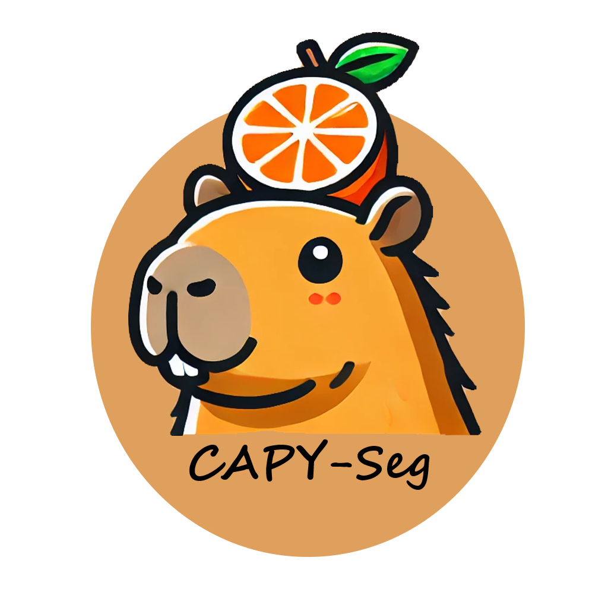
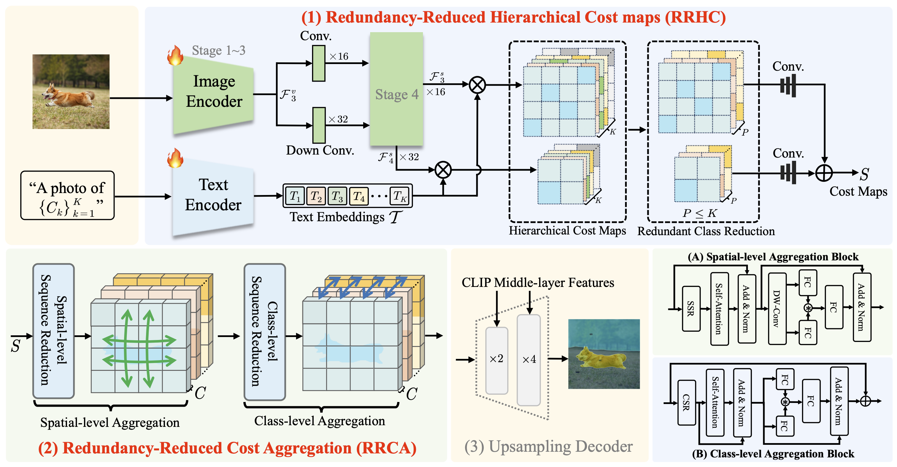
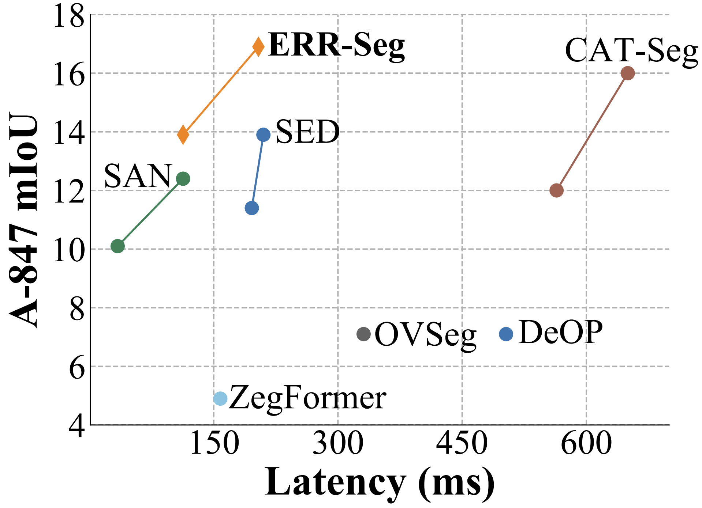

<div align="center">
  
</div>

# <div align="center">Efficient Redundancy Reduction for Open-Vocabulary Semantic Segmentation<div>
<div align="center">
  <div>
  <a href="https://arxiv.org/abs/2501.17642"></a>&nbsp;&nbsp;
  <a href="https://huggingface.co/lchen1019/ERR-Seg"></a>&nbsp;&nbsp;
  <a href="[https://arxiv.org/abs/2501.17642](https://arxiv.org/abs/2501.17642)"></a>
  </div>
  
</div>

## 📚Introduction

Open-vocabulary semantic segmentation (OVSS) is an open-world task that aims to assign each pixel within an image to a specific class defined by arbitrary text descriptions. While large-scale vision-language models have shown remarkable open-vocabulary capabilities, their image-level pretraining limits effectiveness on pixel-wise dense prediction tasks like OVSS. Recent cost-based methods narrow this granularity gap by constructing pixel-text cost maps and refining them via cost aggregation mechanisms. Despite achieving promising performance, these approaches suffer from high computational costs and long inference latency. In this paper, we identify two major sources of redundancy in the cost-based OVSS framework: redundant information introduced during cost maps construction and inefficient sequence modeling in cost aggregation. To address these issues, we propose ERR-Seg, an efficient architecture that incorporates Redundancy-Reduced Hierarchical Cost maps (RRHC) and Redundancy-Reduced Cost Aggregation (RRCA). Specifically, RRHC reduces redundant class channels by customizing a compact class vocabulary for each image and integrates hierarchical cost maps to enrich semantic representation. RRCA alleviates computational burden by performing both spatial-level and class-level sequence reduction before aggregation. Overall, ERR-Seg results in a lightweight structure for OVSS, characterized by substantial memory and computational savings without compromising accuracy. Compared to previous state-of-the-art methods on the ADE20K-847 benchmark, ERR-Seg improves performance by $5.6\%$ while achieving a 3.1× speedup.

<div align="center">
  
</div>


## :fire: News

- **`2025/11/26`**: ERR-Seg is accepted by Neurocomputing!
- **`2024/08/03`**: Code is available Now!
- **`2024/08/03`**: Pre-trained weights are available Now!

##  🏷️ TODO

- [x] Train/Evaluation Code
- [x] Pre-trained weights

## :hammer_and_wrench: Install 

-  Create the environment

   ```bash
   conda create -n err-seg python=3.9
   conda activate err-seg
   ```

- Install PyTorch, we recommend PyTorch ≥ 2.2.0, and flash attention will be enabled, and PyTorch ≥ 1.13.0 is also work

   ```bash
   conda install pytorch==2.3.1 torchvision==0.18.1 torchaudio==2.3.1 pytorch-cuda=11.8 -c pytorch -c nvidia
   ```

-  Install Detectron2, for more details, please follow [Detectron2 installation instructions](https://detectron2.readthedocs.io/tutorials/install.html)

    ```
    pip install 'git+https://github.com/facebookresearch/detectron2.git'
    ```

- Install open_clip_torch

   ```bash
   cd open_clip/
   pip install -e .
   ```

-  Install more requirement

   ```bash
   pip install -r requirements.txt
   ```

-  Prepare the dataset; please follow [dataset preperation](datasets/README.md).

-  Train our model on 4 GPUs by using `run.sh`  and save the log in `output`

    ```bash
    bash run.sh configs/convnextB_640.yaml 4 output/
    ```
    
-  Evaluate on 4 GPUs by using `eval.sh`  and the checkpoint saved in `output/model_final.pth`

	```bash
   bash eval.sh configs/convnextB_640.yaml 4 output/
   ```

## :arrow_forward: Results

<div align="center">
  
</div>


The model weights can be download [here](https://huggingface.co/lchen1019/ERR-Seg).


| Model        | CLIP       | A-847 | PC-459 | A-150 | PC-59 | PAS-20 | 
| ------------ | ---------- | ----- | ------ | ----- | ----- | ------ | 
| ERR-Seg (B) | ConvNext-B | 13.9  | 20.5   | 35.8  | 56.9  | 95.4   | 
| ERR-Seg (L) | ConvNext-L | 16.9  | 23.9   | 38.3  | 60.7  | 96.6   | 


## :hearts: Acknowledgement

Our model is related to [CAT-Seg](https://github.com/KU-CVLAB/CAT-Seg) and [SED](https://github.com/xb534/SED). Thanks for their great work! We also thank great previous work including [SimBaseline](https://github.com/MendelXu/zsseg.baseline), [DenseCLIP](https://github.com/raoyongming/DenseCLIP), [SAN](https://github.com/MendelXu/SAN), [SSA](https://github.com/fudan-zvg/Semantic-Segment-Anything), etc. 


## :black_nib: Citation

If you find our work helpful for your research, please consider citing the following BibTeX entry. 
